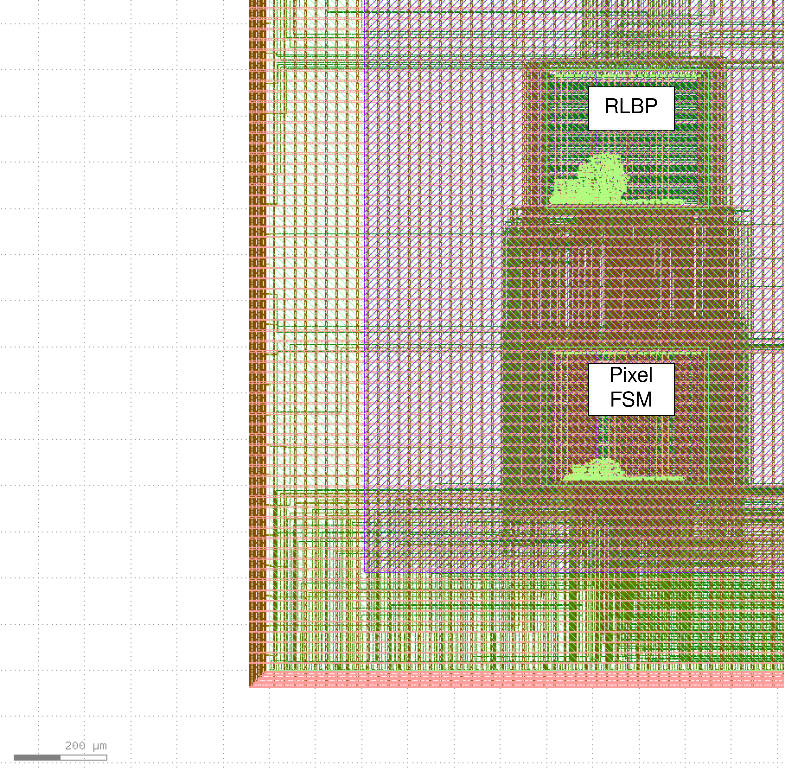

# README

## Digital Macros: Preliminar Layout (manual placement)

## Digital Macros, Register Map

### Pixel FSM

- Wires interconnection to Caravel LA

| Pixel FSM ports | Caravel LA out [127:0] |
| --- | --- |
| wire_pxl_q | [3:0] |
| wire_data_sel | [7:4] |
| wire_loc_timer_en | [8] |
| wire_adj_timer_en | [9] |
| wire_s_p1 | [10] |
| wire_s_p2 | [11] |
| wire_s1 | [12] |
| wire_s2 | [13] |
| wire_s1_inv | [14] |
| wire_s2_inv | [15] |
| wire_v_b0 | [16] |
| wire_v_b1 | [17] |
| wire_pxl_done_o | [18] |
| wire_loc_timer_max | [19] |
| wire_adj_timer_max | [20] |
| wire_kernel_done_o | [21] |

### RLBP FSM

- Wires interconnection to Caravel LA

| RLBP FSM ports | Caravel LA out [127:0] |
| --- | --- |
| wire_reset_fsm | [22] |
| wire_rlbp_done | [23] |
| wire_q1_3 | [24] |
| wire_q1_2 | [25] |
| wire_q1_1 | [26] |
| wire_q2_3 | [27] |
| wire_q2_2 | [28] |
| wire_q2_1 | [29] |
| wire_q3_3 | [30] |
| wire_q3_2 | [31] |
| wire_q3_1 | [32] |
| wire_control_signals | [36:33] |

